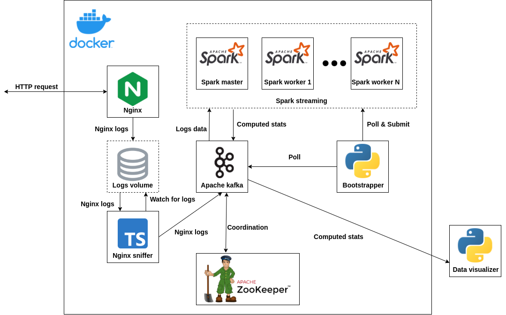

# Requirements
- Python3
- Docker
- Docker-compose

# Architecture


Architecture consists of a set of several containers built by `Docker` and one local app for data visualization written in `Python3`. All containers are deployed together via `docker-compose` in the same network.

Containers are accessible through exposed ports on localhost, howerver most of the ports are exposed just for communication with other container and it are not expected to be used manually by the user.

- Nginx (`pdi-nginx`) - `localhost:8000` - HTTP request are expected to generate nginx logs
- Apache Kafka (`pdi-kafka`) - `localhost:29092` - Kafka consumers are expected to connect (eg. from visualization app)

## Nginx & Nginx sniffer
Nginx produces a log upon received HTTP request and this log is stored in the persistent docker volume. Nginx sniffer watches for the changes in the persistent volume. Whenever the log from the Nginx is stored it processes the log, sends it to Apache Kafka and deletes the log. Logs exporting is done via NJS language which is a subset of the JavaScript language that allows extending Nginx functionality.

## Bootstrapper
This is a container which is supposed to submit the job for the Spark streaming. It actively polls for the container with Kafka to ensure the Kafka is up and running. Then it actively polls for the Spark streaming and checks whether there are workers available. And finally if everything is up and running correctly it submits the job.

## Apache Kafka
Apache Kafka is coordinated using the `Apache Zookeeper`. It receives data from the logs which are then taken by the `Spark Streaming` and it also receives computed stats from the `Spark Streaming` which are then available for the consumers.

Kafka topics:
* Kafka ingress topic - `spark-ingress`
* Kafka egress topic - `spark-egress`

## Spark Streaming
Spark streaming gets the data from Kafka and computes the desired statistics and sends it back to Kafka. It uses the Python 3 Spark API.

## Data visualization
See [visualizer readme](visualizer/README.md) for details.

# Starting project

## Pipeline
In the root of the folder run:
```
docker-compose up --build --scale pdi-spark-worker=3
```
This will rebuild the files and containers. This will take a few minutes. We recommend to use at least 3 instances of the pdi-spark-worker which significantly speeds up the stats computing.

It is recommended to wait on a first run several minutes before using the pipeline so everything is setup correctly.

For next usage after the build is done use just:
```
docker-compose up --scale pdi-spark-worker=3
```

## Data visualizer
Make sure the pipeline is setup end running before you run the data visualizer.

See [visualizer readme](visualizer/README.md) for details.


## Project structure

* `/bootstrapper`
    * `boostrapper.py` - python3 polling script which serves as an entrypoint for bootstrapper container
    * `Dockerfile` - Dockerfile for building bootstrapper container image
    * `requirements.txt` - python3 requirements for the `bootstrapper.py`
* `/kafka`
    * `kafka.env` - file with environment variables for the Kafka container and other possible components using this container
* `/nginx`
    * `/src`
        * `nginx_sniffer.js` - Nginx logger which is ran in NJS
        * `nginx.conf` - config file for Nginx
    * `change_volume_perm.sh` - shell script for changing the permissions for the nginx log file
    * `Dockerfile` - Dockerfile for building nginx container image
    * `nginx.env` - file with environment variables for the nginx container and other possible components using this container
* `/nginx-sniffer`
    * `/src`
        * `exporter.ts` - Nginx sniffer source code
    * `Dockerfile` - Dockerfile for building nginx-sniffer container image
    * `Makefile` - Makefile which servers as an entrypoint for nginx-snigger container
    * `nginx-sniffer.env` - file with environment variables for the nginx-sniffer container and other possible components using this container
    * `package-lock.json` - npm file for dependency lock
    * `package.json` - npm file for dependencies
    * `tsconfig.json` - TypeScript project config file
* `/spark`
    * `Dockerfile` - Dockerfile for building spark container image
    * `requirements.txt` - python3 requirements for the `spark.py`
    * `spark.env` - file with environment variables for the spark container and other possible components using this container
    * `spark.py` - Spark aggregating job source code
* `/visualizer`
    * `README.md` - visualizer readme
    * `requirements.txt` - python3 requirements for the `visualizer-cli.py`
    * `visualizer-cli.py` - visualizer CLI source code
* `docker-compose.yml` - compose file for orchestrating the whole project
* `README.md` - main readme

# Edge cases
* In some cases, there may appear a problems with Apache Kafka. Container is set to restart on failure
* It is highly recommended to watch the bootstrapper logs from the docker-compose
